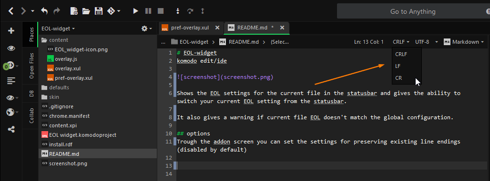

# EOL-widget
komodo edit/ide

Shows the EOL settings for the current file in the statusbar and gives the ability to switch your current EOL setting from the statusbar.

It also gives a warning if current file EOL doesn't match the global configuration.

## options
Trough the addon screen you can set the settings for preserving existing line endings (disabled by default)

